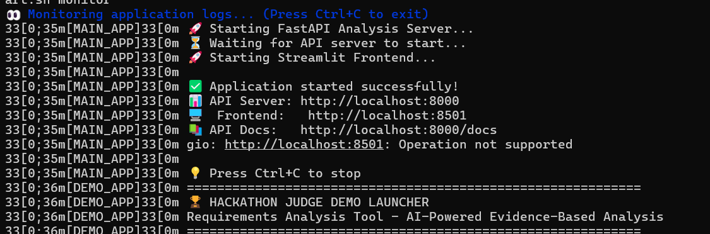

# Watsonx.ai –  Document-Analysis-Tool - Simple RAG Demo


Hello everyone, this is a simple demo to explain how it works RAG in a simple application webapp.

A project for analyzing and validating requirements using AI-powered evidence-based analysis.


## Features
- **Evidence-Based Analysis**: Searches through your documentation to find supporting evidence for requirements
- **Multi-Model AI**: Uses IBM watsonx models (Granite + Llama) for comprehensive analysis
- **Flexible Vector Database**: Auto-detects existing document collections or creates new ones
- **Web Interface**: FastAPI backend with Streamlit frontend
- **Document Ingestion**: Supports PDF, Markdown, and text files

## Requirements
- **Python 3.11.0** (Required - other versions may not work)
- Poetry 2.1+
- IBM watsonx API credentials

**Important**: Python 3.11 is strictly required. Install Python 3.11 if necessary.
When inside the project folder, configure Poetry to use Python 3.11:

```bash
poetry env use py -3.11
```
## Quick Start

### 1. Clone the repository
```bash
git clone https://github.com/ruslanmv/Watsonx-Document-Analysis-Tool 
cd Document-Analysis-Tool 
```
## Setup

### 2. Install Dependencies
```bash
poetry install
```

If there are problems, try:
```bash
poetry lock
```

### 2. Configure Environment
Create a `.env` file (you can copy from `.env.template` if available):
```bash
WATSONX_API_KEY=your_api_key_here
WATSONX_PROJECT_ID=your_project_id_here
WATSONX_ENDPOINT=https://us-south.ml.cloud.ibm.com
```

### 3. Ingest Documents
Place your documents (PDF, MD, TXT) in the `./documents` folder, then run:
```bash
poetry run python scripts/ingest_docs.py --reset
```

This creates a vector database from your documents that the AI uses for evidence-based analysis.

### 4. Run the Application
```bash
poetry run python run_app.py
```

This starts both the API server (port 8000) and web interface (port 8501).

## Demo Mode

For a judge-friendly demo showcasing the complete analysis pipeline:
```bash
poetry run python run_judge_demo.py
```

This starts the demo interface on port 8502 with auto-selected diverse requirements.

## Troubleshooting

### "No documents found in vector database"

If you see this warning when running the app:

1. **Check what collections exist:**
   ```bash
   poetry run python scripts/check_collections.py
   ```

2. **Re-ingest documents:**
   ```bash
   poetry run python scripts/ingest_docs.py --reset
   ```

3. **Verify documents folder:**
   Make sure you have documents in `./documents/` folder

### Collection Management

The system automatically detects and uses existing document collections. You can also:

- **Use a specific collection name:**
  ```bash
  python scripts/ingest_docs.py --collection my_project_docs
  ```

- **Set default collection via environment:**
  ```bash
  export COLLECTION_NAME=my_collection
  ```

- **List all available collections:**
  ```bash
  python scripts/check_collections.py
  ```

## Usage

1. **Access the web interface** at http://localhost:8501
2. **Enter your requirements** in the different categories (Functional, Performance, Security, etc.)
3. **Run analysis** - the system will search your documents for supporting evidence
4. **Review the generated report** with evidence-backed recommendations

## API Endpoints

- **GET /health** - Check system status
- **POST /analyze** - Analyze requirements (JSON format)
- **GET /docs** - Interactive API documentation

## Project Structure

```
├── agent/                      # AI embeddings and LLM utilities  
├── scripts/                    # Document ingestion and utilities
├── frontend/                   # Streamlit web interface
├── documents/                  # Place your documents here
├── chroma_db/                  # Vector database storage
├── config.py                   # Centralized configuration
├── requirements_analyzer_enhanced.py  # Core analysis engine
├── api_server.py               # FastAPI web server
├── run_app.py                  # Application launcher
├── judge_demo.py               # Demo interface for presentations
├── run_judge_demo.py           # Demo launcher
└── JUDGE_DEMO_README.md        # Demo-specific documentation
```


##  Scripts

bash install.sh

bash start.sh


bash start.sh monitor



bash start.sh stop
